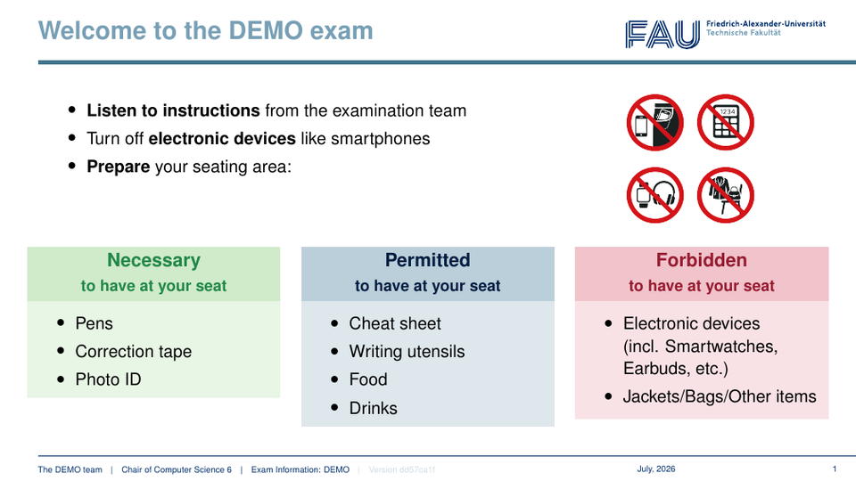
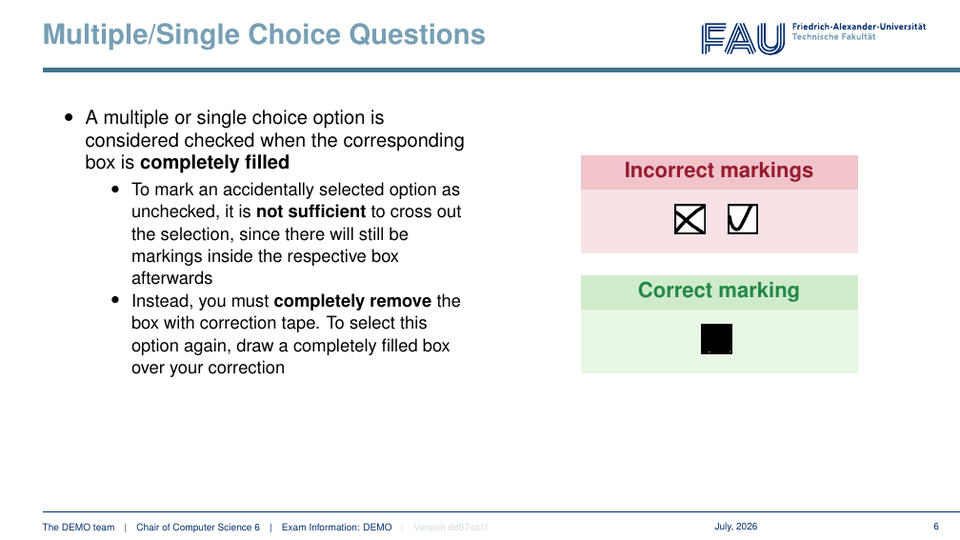
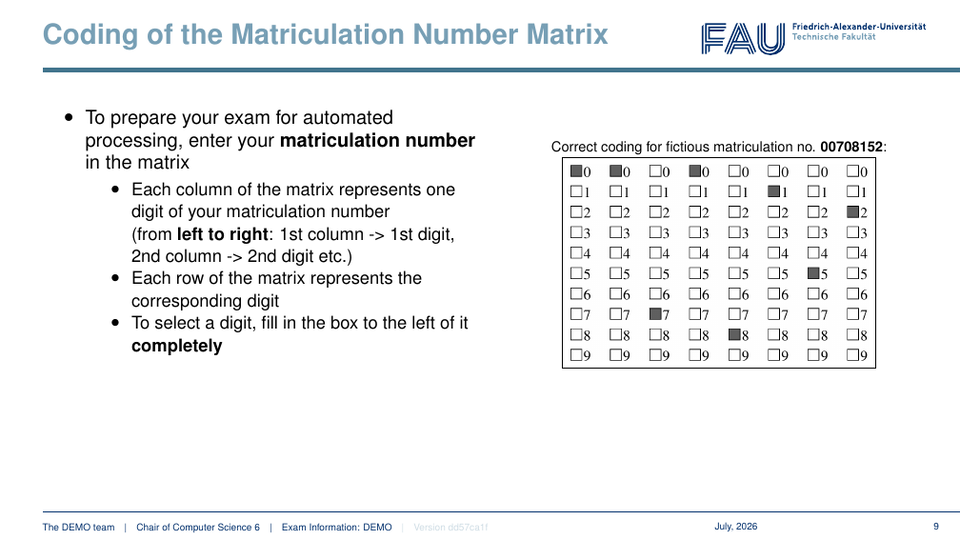
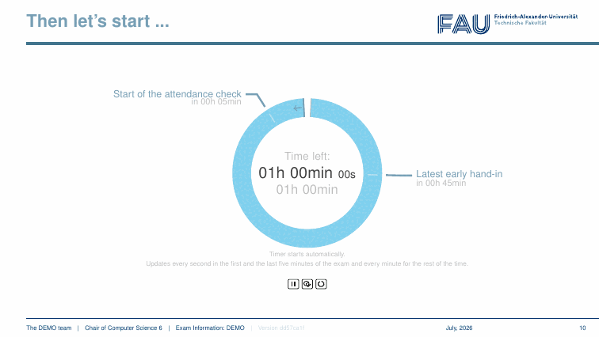
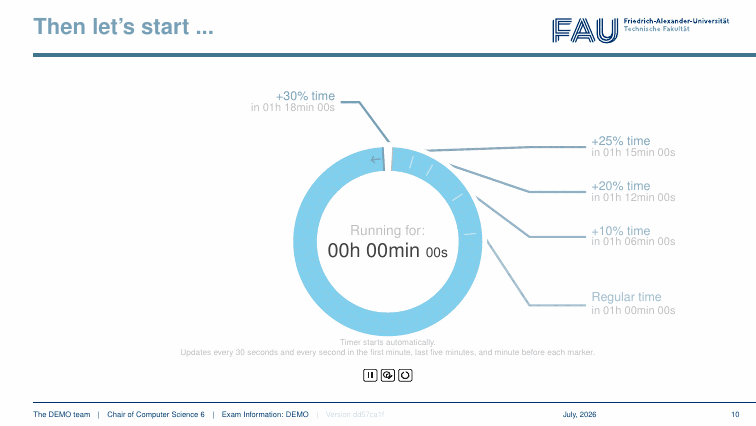

# Exam Introduction

This repository contains presentations for use before and during an exam. The presentations contain the most important things students should be taught before an exam. In addition, the presentation contains a built-in timer for the exam.

## Reader compatibility 

To use the timer functionality of the presentation, the PDF reader must support JavaScript-driven animations.

Here is a small list of tested compatible/not compatible readers:

### Compatible 

| PDF Reader | Operating System | Tested Version of the PDF Reader |
| ---      | ---      | ---      |
| Adobe Acrobat Pro | Windows 11 Pro | 22.003.20322 |
| Adobe Acrobat Pro | macOS Sonoma 14.2.1 | 23.8.20470.0 |

It can be assumed that the compatible PDF readers are compatible regardless of operating system and version (at least if newer than the tested one). A short test before the exam is nevertheless recommended.

### Partially Compatible

| PDF Reader | Operating System | Tested Version of the PDF Reader |
| ---      | ---      | ---      |
| Okular | Debian 11 | 20.12.3 |

The Okular test predates the latest timer extensions. Okular can display the presentation and supports the basic animation mechanisms, but the current timer is not fully compatible: it may not start automatically because Okular does not process the PDF `PageVisible` action, and the manual elapsed-time correction is unavailable because Okular does not implement `app.response`. Use a tested Adobe Acrobat version for the complete interactive timer workflow.

### Not Compatible 

| PDF Reader | Operating System | Tested Version of the PDF Reader |
| ---      | ---      | ---      |
| Google Chrome | Windows 11 Pro | 110.0.5481.178 |

## Settings

For each module with a written exam, a file `exam-introduction-[name of module].tex` should be created. In this file the most important settings for the presentation (name of the exam, duration of the exam, language, etc.) can be specified.

It should look like this:

```latex
\documentclass[aspectratio=169,t]{beamer}

%%%%%%%%%%%%
% Settings %
%%%%%%%%%%%%

% Set the name of the exam (should be short and unique, e.g. EDB, EBTEIS, POIS, KonzMod, ...)
%
\def\exam{KDDmUe}

% Set the duration of the exam in minutes
%
\def\duration{90}

% Optional: Set comma-separated percentage-based time extensions (maximum five
% unique values greater than 0 and at most 100). If defined, the timer counts up
% to the longest extension and replaces attendance/early-hand-in arms with one
% arm per end time.
% The values may be given in any order.
%
%\def\timeExtensionPercentages{20,25,30,50}

% Comment in if the start of the attendance check should be visible in the timer
% Set the time for the start of the attendance check in minutes after the start of the exam 
% (should always be in between 0 and \duration/2). 
%
\def\startAttendanceCheck{5}

% Comment in if the latest time for the early hand-in should be visible in the timer
% Set the latest time for the early hand-in in minutes after the start of the exam 
% (should always be in between \duration/2 and \duration). 
%
\def\latestEarlyHandIn{75}

% Set the number of pages of the exam before using
%
\def\pages{?}

% Comment in if a cheat sheet is allowed. 
% Set to 1 is only one-side of a DIN A4 paper is allowed to be used
% Set to 2 if a double-sided DIN A4 paper may be used.
%
\def\cheatsheetAllowed{1}

% Comment in if an exam inspection link (replace the standard link if necessary) is available
% and the exam inspection is done directly after the grade is published
%
\def\examInspectionLink{https://www.cs6.tf.fau.de/kdd-einsicht}

% Comment in if the language of the exam is german (english is default)
%
%\def\german{1}


%%%%%%%%%%%%%%%%%%%
% Import the code %
%%%%%%%%%%%%%%%%%%%

% Import the presentation
\include{src/presentation}
```

## Compiled demo presentations

Two ready-to-use, 60-minute demo presentations show both timer configurations:

- [Download the standard demo](demo/exam-introduction-demo.pdf)
- [Download the demo with time extensions](demo/exam-introduction-demo-with-time-extensions.pdf) (10%, 20%, 25%, and 30%)

The source configurations are stored next to the PDFs. Download a PDF and open it in one of the fully compatible readers listed above to try the complete interactive timer; browser PDF viewers generally only show its first frame.

## Preview

| Welcome and permitted materials | Answer marking | Matriculation number |
| --- | --- | --- |
|  |  |  |

The timer previews below compress the complete runtime into a few seconds:

| Standard countdown | Time extensions |
| --- | --- |
|  |  |

## License

Except for the FAU branding assets in `fau-res/`, this project is licensed under
the [Creative Commons Attribution-ShareAlike 4.0 International
License](LICENSE). Adaptations may be shared for any purpose provided that
appropriate credit is given and the adapted material is distributed under the
same license. See [LICENSE-NOTICE.md](LICENSE-NOTICE.md) for the license scope,
attributions, and the FAU branding exception.
